# Azure-Sentinel-HoneyPod
Created a Honeypod using Azure Sentinel

Below a short diagram on how the Lab will look like.

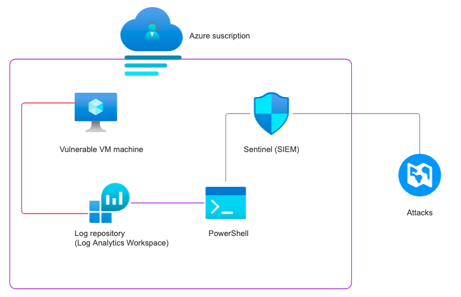

## Intro

I would like to inform that this lab is not mine, I just followed the steps that Josh Madakor provided in one of his Youtube videos.<br>
Here the link: https://www.youtube.com/watch?v=RoZeVbbZ0o0

But I found the idea interesting and wanted to try somehting similar for quite sometime.

## 1) Create VM-Machine

I looked for ```Virtual Machines``` in the search bar.
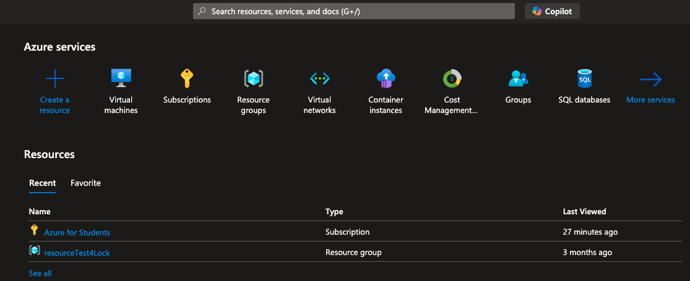

First of all let's create a new ```Resource group```.
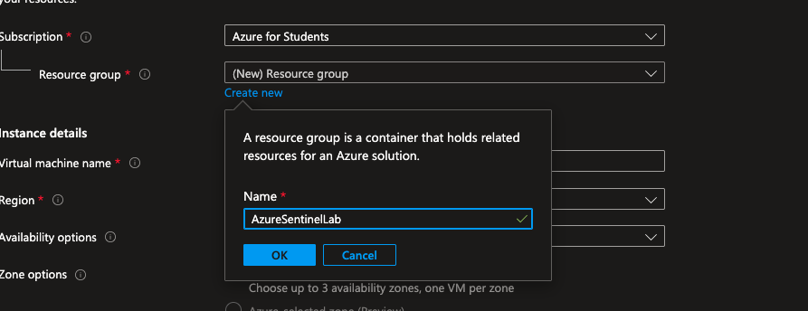

And now fill out the the VM details.
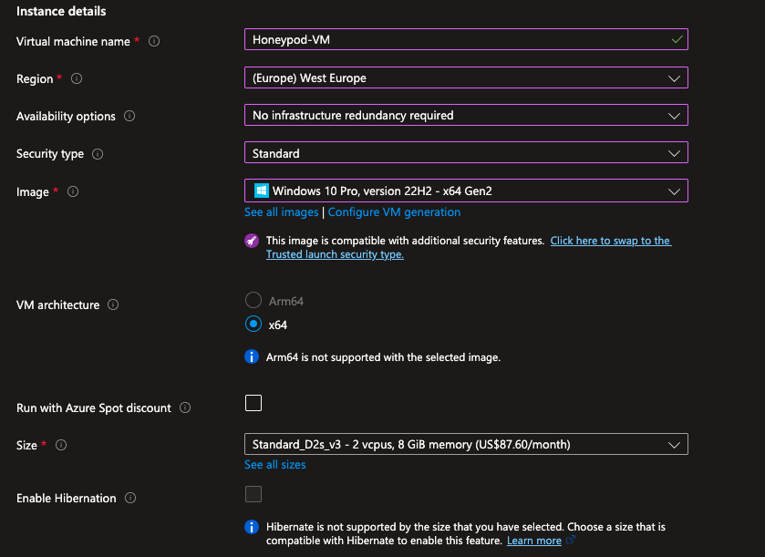
<br>
Check on networking tab (under NETWORK tab is where the "firewall" rules needs to be created).
<br>
-> NIC network security group, click on advance and create a new security group.
<br>
The **NIC Network Security Group (NSG)** in Azure is a security feature associated with the **Network Interface Card (NIC)** of a virtual machine (VM). It controls inbound and outbound traffic to the VM at the network interface level.

Let's remove the default one and create a new one allowing all incoming traffic.

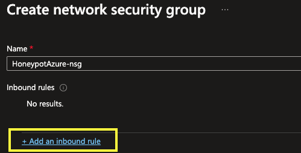

-> Configure a new network security group by removing the default role<br>
	-> Source port ranges: *<br>
	-> Destination: Any<br>
	-> Destination port ranges: *<br>
	-> Protocol: Any<br>
	-> Actions: Allow<br>
	-> Priority: 100<br>
	-> Name: Everyone_is_allowed<br>
<br>
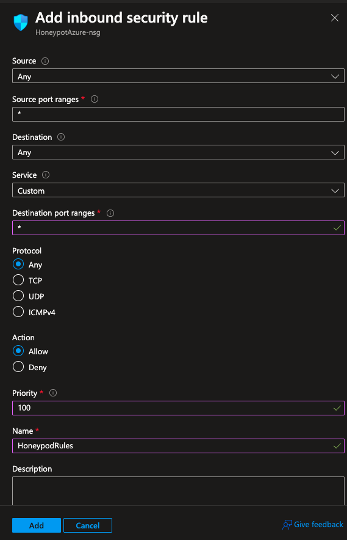

Now we can create the VM. The deployment can take some time, so be patient.

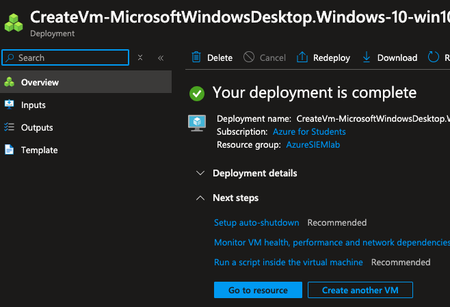

Once VM is created, you can access it by connecting remotely. As I use a Mac, the tool used is Windows App.

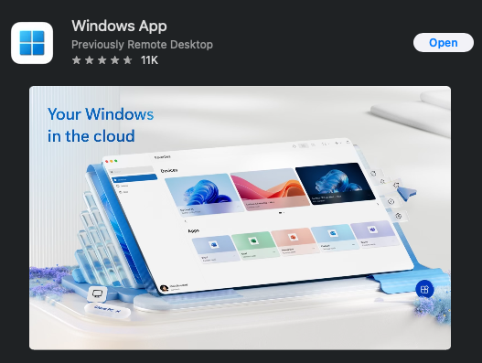

To access the virtual machine, add a new PC in the app.

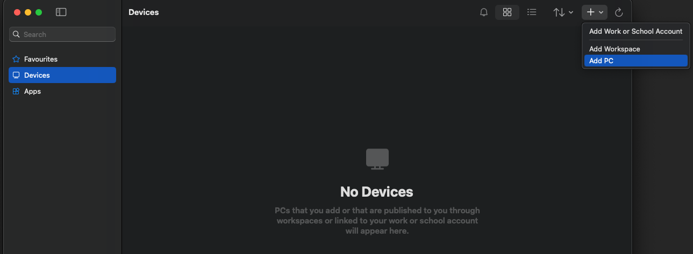

To do so, just copy paste the **public IP** you received after the machine is deployed, under ```Overview tab```.

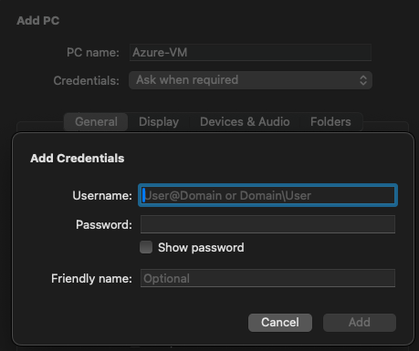

To check the information of this VM, you can do it under System Settings.

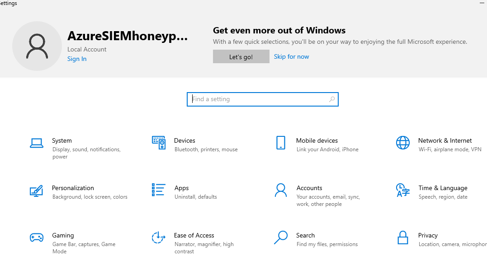

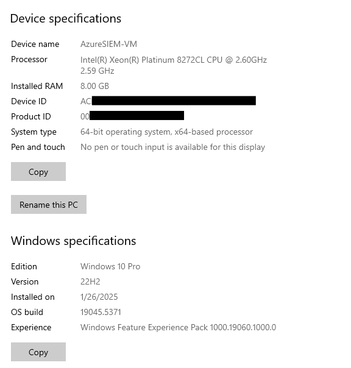

**Note**: Device name changed as I had to redo all the previous steps :)

## 2) Create Log Analytics Workspace

In here I will create custom logs that contains geographic information.

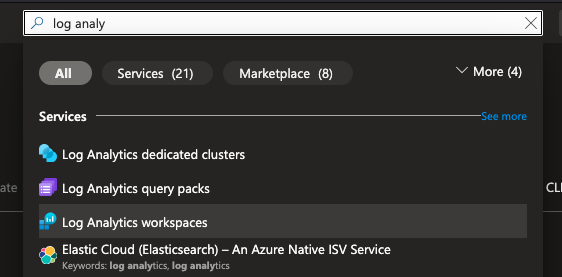

I used the same resource group as previously created. Just give it a name and the region (same used as for the VM).

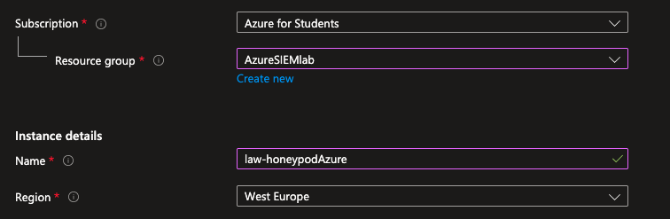

## 3) Microsoft Defender for Cloud

In here I enable the ability to gather logs from the VM into the Log Analytics Workspace.
Under **Management** on the left side of the panel, chose ```Environment settings```, and do all the way down till the Log Analytics Workspace created previously is visible.

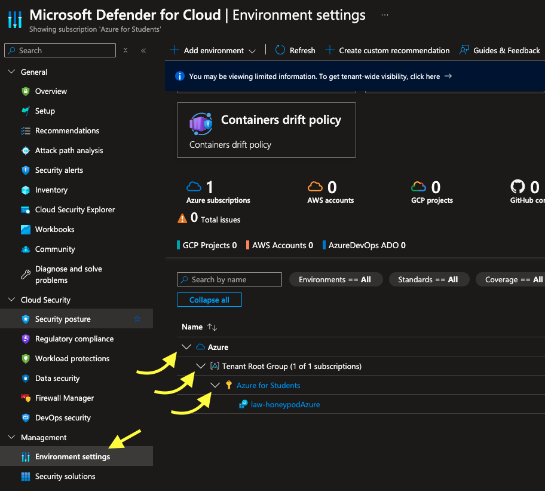

In here I activate the ```Defender plans```with exception of **SQL Servers**, as it's not needed in this Lab example. Click on ```save```.

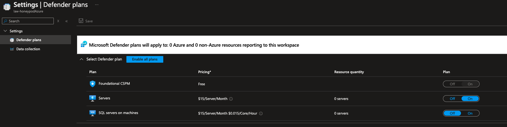

After this, under ```Data collection``` I selected **All events** and saves the changes.

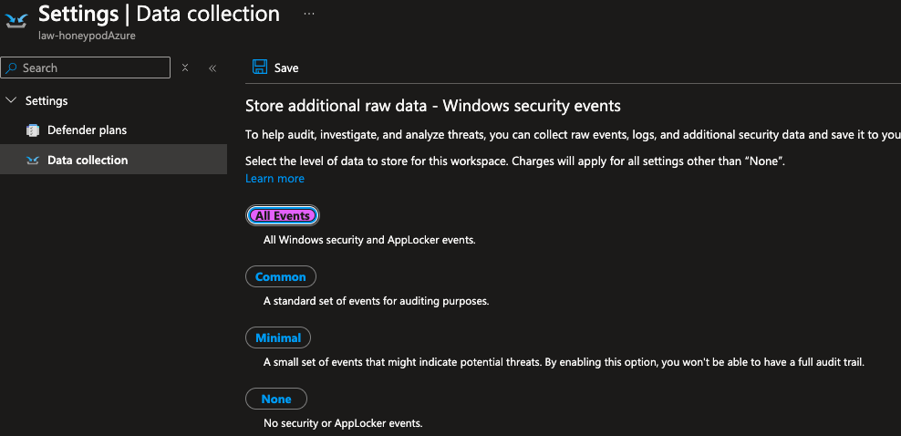

## 4) Connect LAW to the VM

I went back to Log Analytics workspaces and selected the one record I had: ```law-honeypodAzure```.
Under ```Classic -> Virtual Machines (deprecated)``` select the VM.

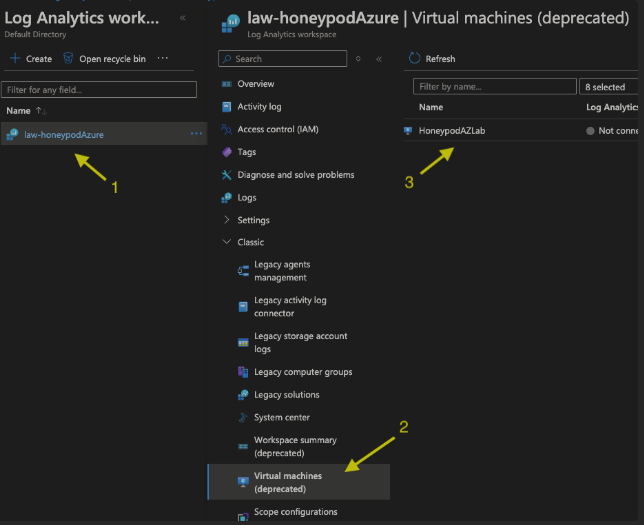

And connect it.

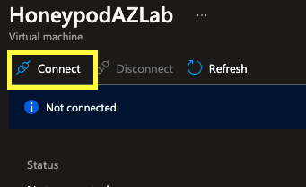
## 5) Set up Sentinel

It's time to set up SENTINEL, just check for it in the search bar.

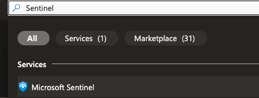

Clicked on ```Create Microsoft Sentinel``` and selected the workspace already created.
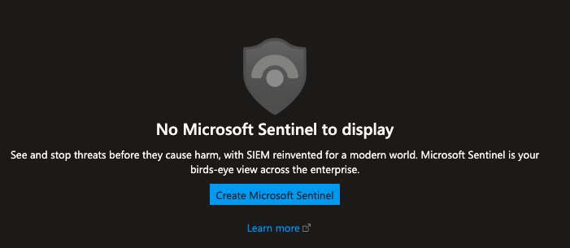
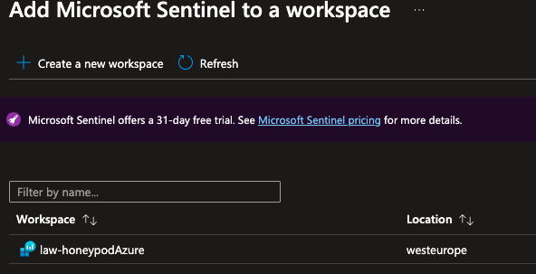

## 6) Set up event logs in VM machine

Enter the VM again and check for the ```Event Viewer -> Windows Logs -> Security``` (this can take a while to load all events).
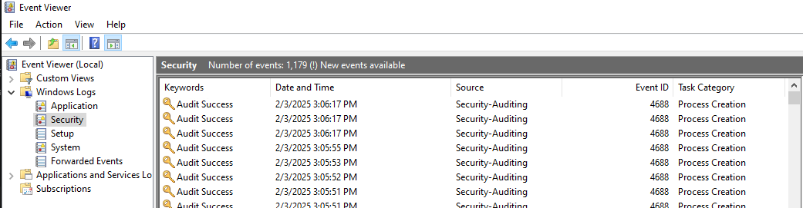

The idea is to focus on a specific type of events, the ```Audit Failure```on a log in attempt.
In order to see one, I will make a failed log in attempt to get the ```Event ID```. So what I did was to block my session with ```Ctrl + D```and log into the machine using a wrong password on purpose.

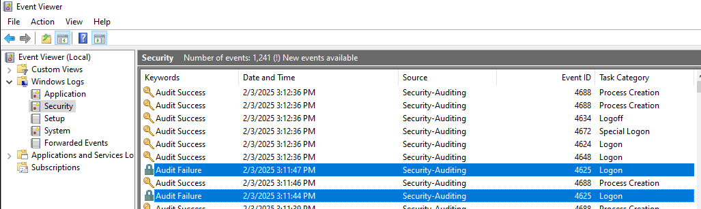

Now I have the needed ```Event ID -> 4625```.

By double clicking the event, I can see what happened and the IP that tried to log in to my VM.

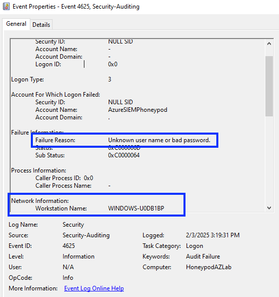

The idea behind this is to use an Geolocation API that provides the Altitude and Latitude of the IP that tried to log in to the VM machine.

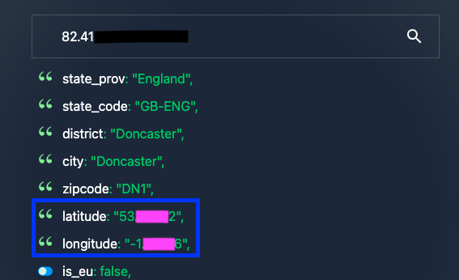

In order to maximize the chances to make this VM "discoverable" in the internet, I will turn off the Firewall.
Will try ping it from my own machine before and after turning off the MS Firewall.

In order to do so, I will use the PowerShell script already created by Josh Madakor.

Before:
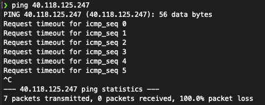

After:
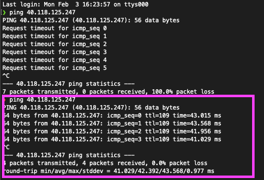

To turn off the firewall I can search for Firewall in the search bar and turn of the available options for Domain, Public and Private.
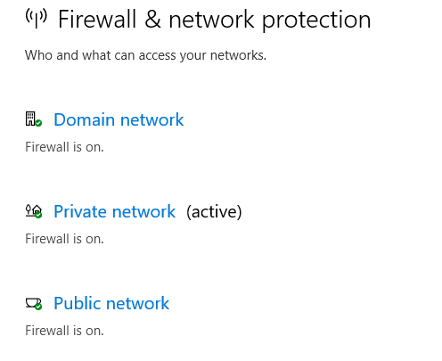

Or also look type the specific command ```wf.msc```and turn off the same options as before.
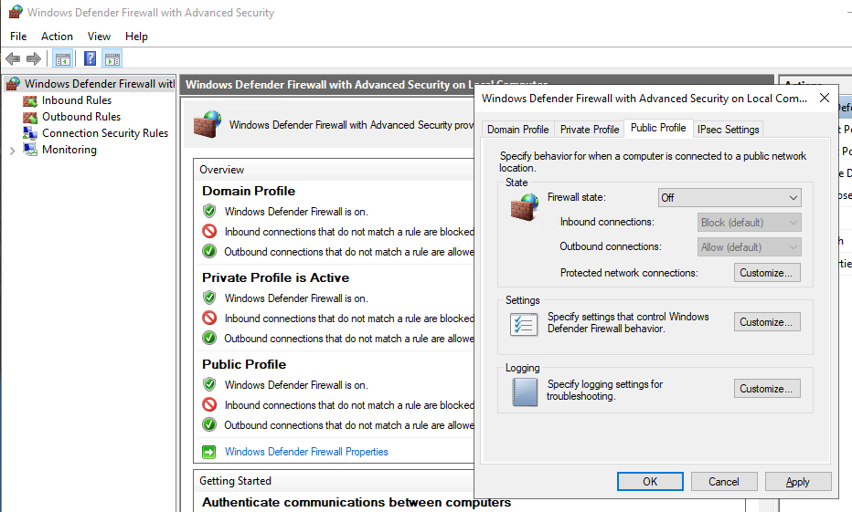

Now the Firewall is not active anymore in this VM.
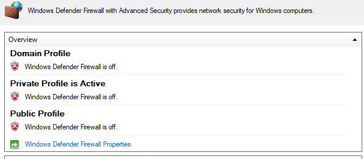

## 7) Create the PowerShell script

On this part, the PS script will help to allocate in a map the attacks, thanks to converting the ```lat & long```from the IPGEOLOCATION web.
For this I need to create a personal API KEY.
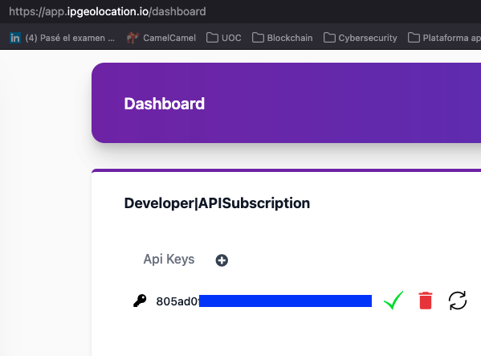

I just replaced the API KEY Josh used for his demonstration, as that part of the code is hardcoded. What the script does is basically filtering **Event Logs for Failed RDP Attempts**, that's why the previous ```Event ID```was so important, and by checking the IP of the attacker, it converts the geolocation in to a visual example with a Map.
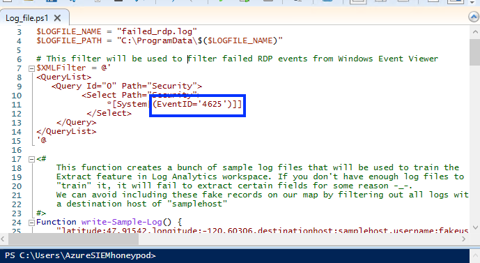

## 8) Create a custom LOG inside of the LAW

In Azure portal, I had to look for the **Custom Log wizard**, as this step is a bit different that from the guide from Josh Madakor.
```LAW -> my_workspace -> Tables```
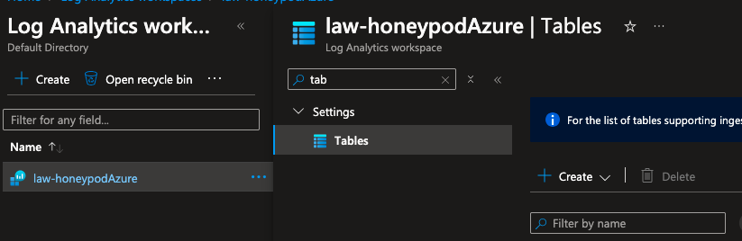

In here I loaded a sample file under ```+ Create -> New custom log (MMA-based)```. I created that sample by running the previous script, it generates a log fle under ```%ProgramData%```.
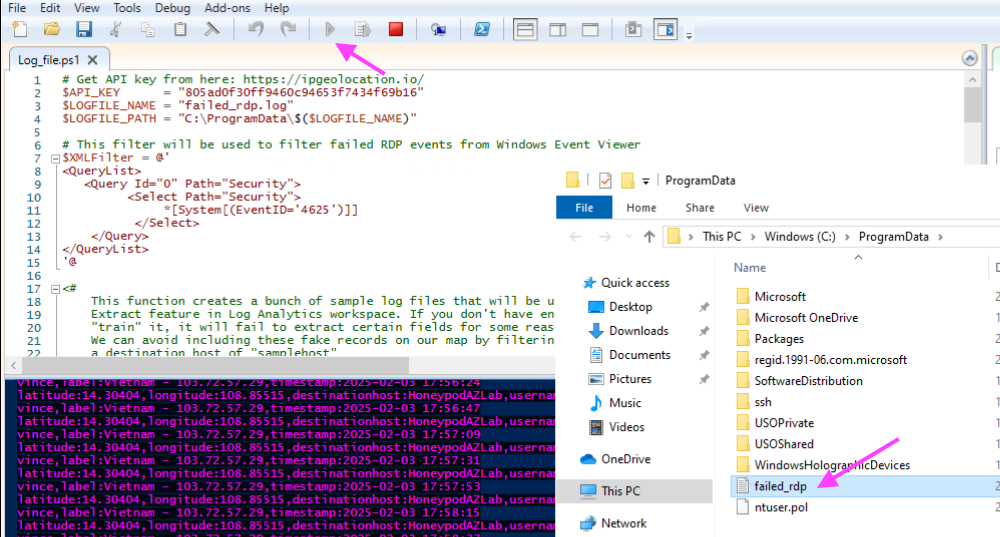

I just copy pasted the data of the file on the host machine to use it as a sample to load in LAW in Azure.
Under collection paths, I select ```Windows```and the path of the log file in the Windows VM machine, which was ```C:\ProgramData\failed_rdp.log```. This path needs to be exactly the same as in the VM otherwise it will not collect the data correctly.
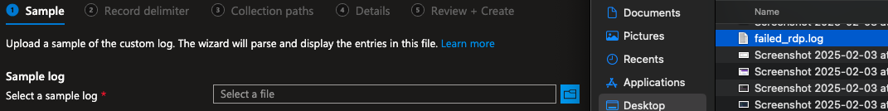

I named my custom table ```Failed_rdp_GEO```.
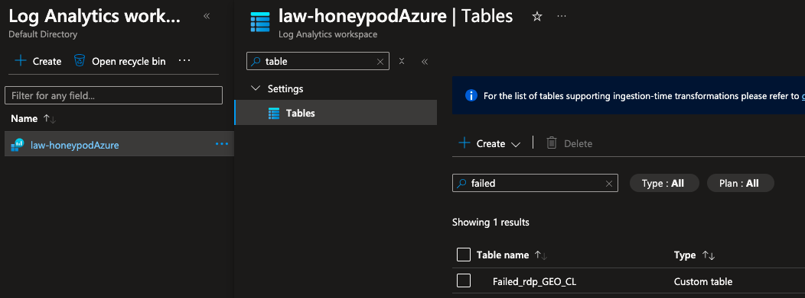

To check if this works, I can go back to ```LAW -> Logs```and run the Query for ```SecurityEvents``` by filtering the Event ID, as the custom logs will take a while to load.
Query would be: ```SecurityEvent | where EventID == 4625```
As I can see, I already get some log in attempts.
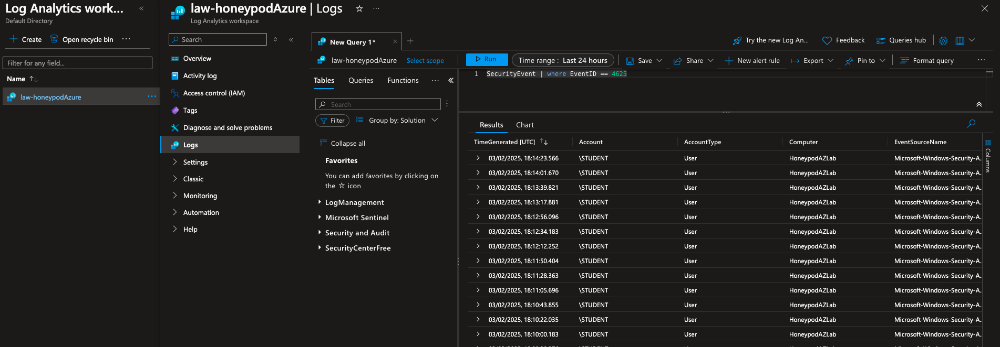

By looking for the IP on the first line, I see the attempt come from Vietnam :) (that was fast, was not expecting to get some data so soon while I'm still on the stes of creating this lab).
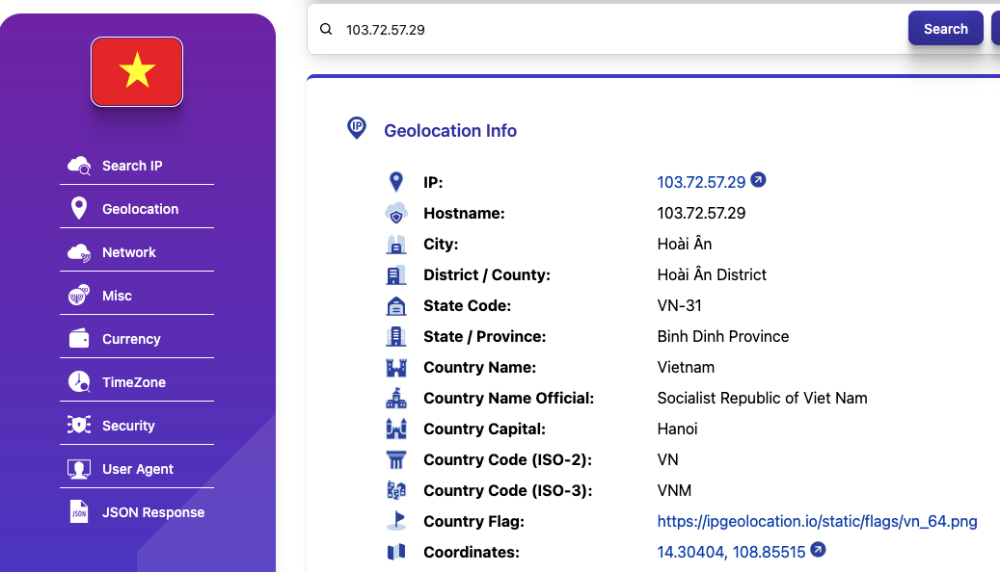

I let the VM sync for a couple of hours and could see some attacks.
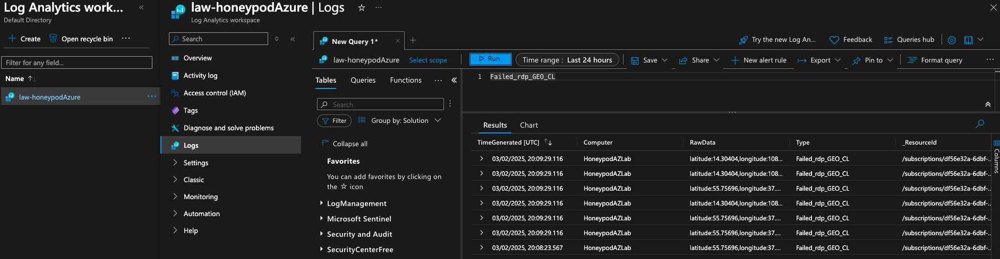

On this part, Josh was able to extract the needed data / ID's and train the sample data. Seems this steps is not possibel anymore or at least I was not able to find out how to do that. I checked if I had some missing rights for this, but seems not have been the case.
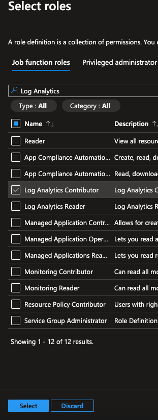

So as a workaround, on the next part, which is to create the heatmap to show the location of all attacks, I had to create en alternative SQL Query to filter out the needed data.

## 9) Creating the Heatmap

First of all, what is a heatmap?
A **heatmap** is a data visualization technique that represents values using variations in color intensity. It is commonly used to analyze patterns, trends, and distributions in datasets.
### **Types of Heatmaps:**

1. **Geographical Heatmaps** – Used in maps to show density (e.g., population density, crime rates), or in this case, the (almost) exact location of the attacks.
2. **Website Heatmaps** – Used in UX/UI to track user interactions like clicks, scrolling, and mouse movements.
3. **Correlation Heatmaps** – Used in data science to visualize relationships between variables.
4. **Performance Heatmaps** – Used in monitoring system performance, such as CPU usage over time.

Let's create the heatmap!
I went to the ```Microsoft Sentinel``` and clicked on the created LAW.


On the ```Overview``` tab I was able to see some preview of the attacks, listing the events. 
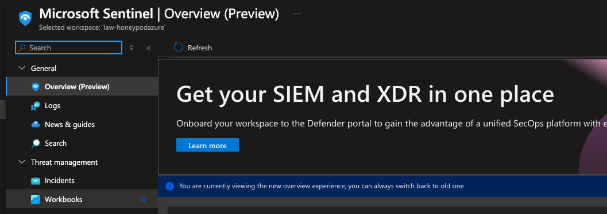

In this part, I created a new customizable dashboard (after deleting the one showing as default) used to visualize and analyze data from **Azure Monitor**, **Log Analytics**, and other Azure services. It allows to create interactive reports, combine multiple data sources, and build rich visualizations, including **heatmaps**.
This type of dashboards are called: ```workbook```
As default there are listed a couple of widgets that can be removed.
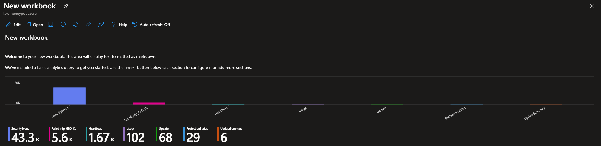

To remove the existing widgets, I just clicked on the right ```Edit```button and selected ```Remove```.
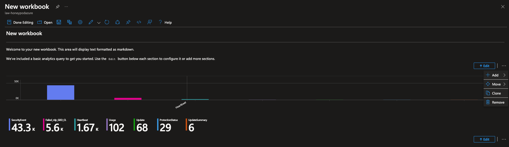

To create a new one, just clicked on ```+ Add > Add query```.
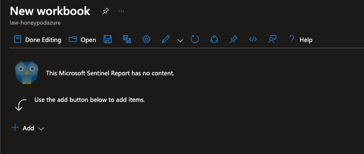

On the field for the Query, I just added my own as I was not able to recreate the step where Josh extracted the id's to train the sample data.
By the time I started playing with the Query, my VM was online for a couple of days, that's why the heatmap shows so many connection attemps.
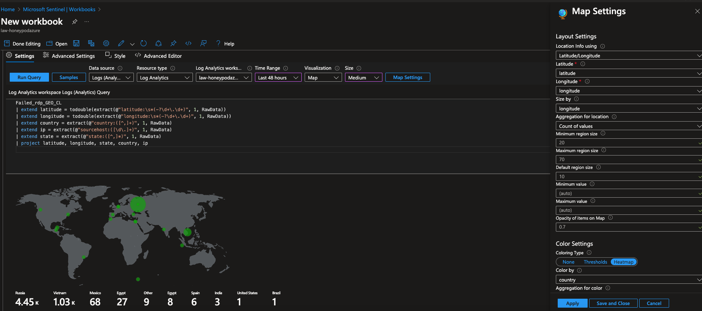

## 10) What was the most used LOGIN credential?

After a couple of more days, I checked the logs in the VM and the new Heatmap again, I saw that the ammount of login attempts increased by a lot.
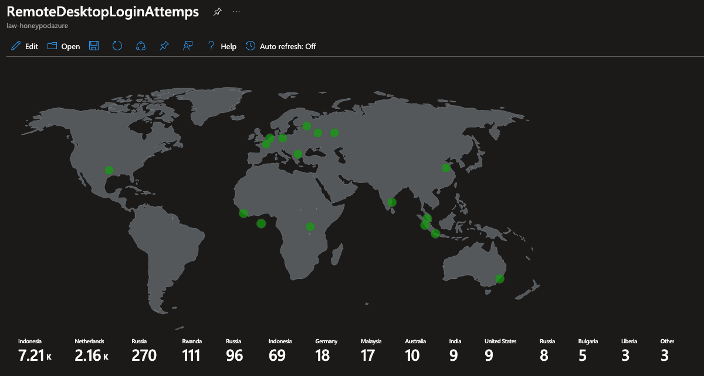

I decided to check what type of USER ID the attackers were trying. 
On the Azure logs tab, I used a simple query filtering by the eventID 4625 and exported to an excel the log file.


Playing around with the CVS file, I was able to see what were the most used USERD ID's.
This is something that I could do as well in Azure, by adapting a bit the previous query.
<br>
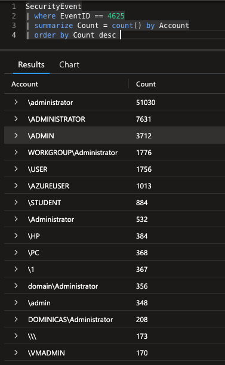

By the time I shut down the VM, the most used USER ID was ```administrator```.

## 11) Final thought

I must say that I enjoyed a lot re-creating this lab by my own. Even if I had little experience in Azure by attending prep courses for the AZ-900 and Az-104, during this process, I was able to:

- Create a VM from scratch
- Create log file in PowerShell to log connection attempts
- Create and manage Log Analytic Workspaces
- Write KQL queries to filter out the needed data
- Create a heatmap as a new workbook to show in a Worldmap the login attempts
